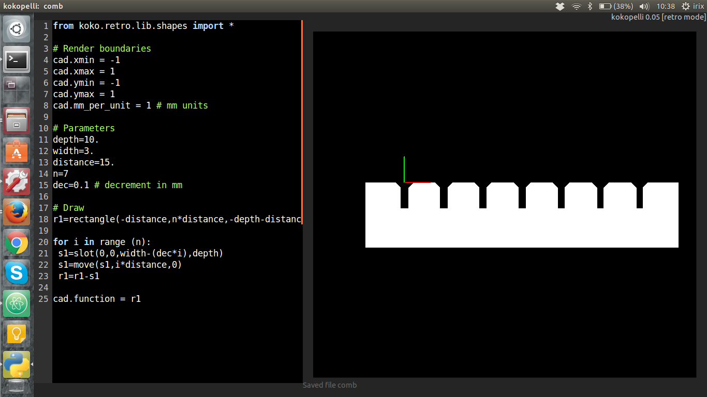
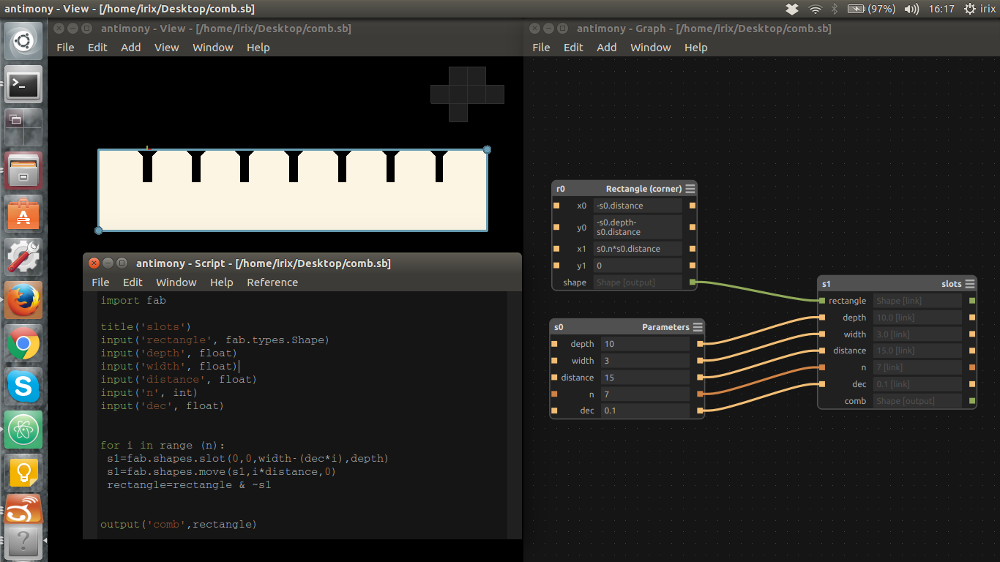

# Computer-Controlled Cutting

# Know your tools

## General tips
These are general tips, not only for successfully completing the assignment, but also for learning in-depth some important concepts. During this week you will use 2D design software for computer controlled cutting applications and the basics of the vinyl and laser cutter.

* This week, spiral development is specially useful for the press-fit design.
* Nesting. Learn how to nest manually and also try tools for nesting like [SVGnest](https://github.com/Jack000/SVGnest).
* Did I ever mention _document as you work_?

## Laser Cutter

How a laser cutter works

* It cuts because it burns

* Lens focusing. Effects of unfocused lenses

* Kerf. Importance in design

Jobs

* Vector cutting

* Vector engraving

* Raster engraving

Settings

* Speed

* Power

* Frecuency

Security

* Danger of a Laser Class 4 beam

* Machine has built in protection

* Do not try to mess or hack the lid. It's not cool

* Fire

    * NEVER leave a laser cutter unattended. EVER

    * If you ever see an unattended laser machine working: SHUT IT DOWN

    * Check your design against double lines

    * Check your design against heat concentration (can the material handle it?)

Not laserable products:

* Vinyl

* PVC

* Any unknown material

Laserable things

* Anything specifically made to be laserable

* Acrylic

* Cardboard

* Wood

* Natural fibers and leather

* In general, all Natural materials

Laserable things that are not recommended

* The risk of Long term exposure to chemicals

* MDF

* Anything laserable that you think it might contain traces of nasty things (glues, paints, coatings…)

## Vinyl Cutter

First time setup (software force control in fab modules)

Loading and unloading materials

* Roll

* Piece

* Cover the Sensor

* Align the material

The test cut

* Remove the circle without removing the square

* Adjusting Force

* Adjusting blade length

Replacing the blade

Cleaning the blade

Replacing the white teflon

Installing vinyl printer in CUPS (compiled version)

* [http://localhost:631](http://localhost:631)

* Connect Roland Vinyl cutter   through USB

* Add printer named **vinyl** (name is important)

* Make: RAW

* Model: RAW

* At the bare minimum learn how to use the machine and **design and fabricate** at least a sticker. (Note the design word, it must be your own design)
* You can start something designed by other. But this does not count towards the assignment.
* Try fab modules and the machine driver. What do you like more?

Going beyond:

* Create a small sticker. What is the smallest shape you can cut?
* Create a big sticker. What happens when static electricity comes into the equation?
* Create a multilayer sticker. Learn how to align the layers.
* Cut a circuit board in copper. That requires [some tricks](http://fab.cba.mit.edu/content/processes/PCB/vinylcut.html).

## Press-fit laser cut design
Use a parametric tool to **design** a press-fit construction set and lasercut it in cardboard. Can either be a modular construction set or [sliced object](http://fab.cba.mit.edu/classes/863.12/people/dsawada/w2.html).

Going beyond:

* Try raster engraving. Experiment with different values of power and speed.
* Try to find the limit resolution of the machine.
* Try to find the **kerf** of the machine. What is the kerf by the way?
* Compare fab modules with the laser driver provided by the manufacturer.
* Try the Javascript fab modules halftone cuts (not in cardboard).
* Experiment with flexures.

## Flexures
* Buttons
* Linear flexures
* Springs
* Damping

# Creating a parametric _comb_ in kokopelli and antimony
A _comb_ is something very useful to cut when you are doing press-fit designs. It helps you to select the correct size of the slot.

## In kokopelli
kokopelli first, because it's my favourite software.



And this is the script, which you can also download [here](./files/comb.ko)
```python
from koko.retro.lib.shapes import *

# Render boundaries
cad.xmin = -1
cad.xmax = 1
cad.ymin = -1
cad.ymax = 1
cad.mm_per_unit = 1 # mm units

# Parameters
depth=10.
width=3.
distance=15.
n=7
dec=0.1 # decrement in mm

# Draw
r1=rectangle(-distance,n*distance,-depth-distance,0)

for i in range (n):
 s1=slot(0,0,width-(dec*i),depth)
 s1=move(s1,i*distance,0)
 r1=r1-s1

cad.function = r1
```
## In antimony
I found this a little bit tricky, but here you are. Also you can also download the file [here](./files/comb.sb).



The node _slots_ has this script inside.
```python
import fab

title('slots')
input('rectangle', fab.types.Shape)
input('depth', float)
input('width', float)
input('distance', float)
input('n', int)
input('dec', float)

for i in range (n):
 s1=fab.shapes.slot(0,0,width-(dec*i),depth)
 s1=fab.shapes.move(s1,i*distance,0)
 rectangle=rectangle & ~s1

output('comb',rectangle)
```

