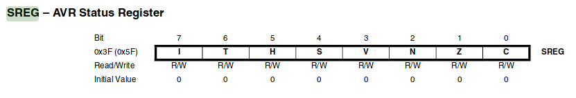
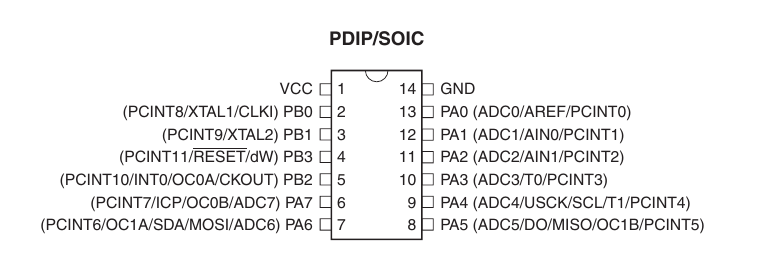
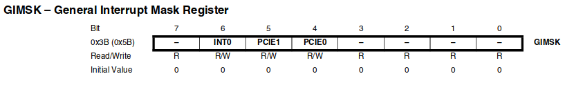
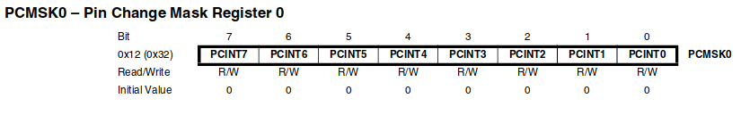
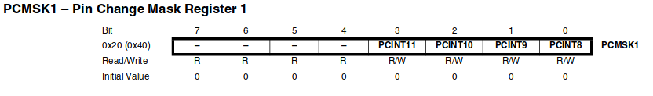
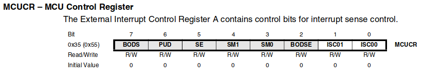
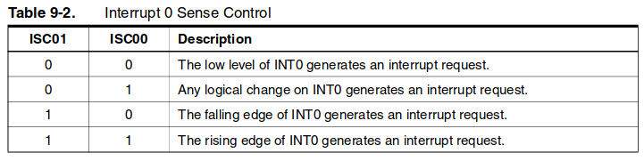
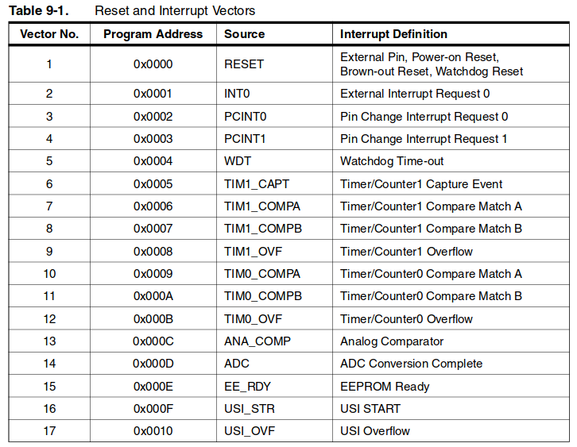

# Embedded Programming

## Embedded Programming

* Basics about programming

    * Add Author, date, description and license

    * Always comment your code

    * Init and loop parts

    * Digital output

    * Analog output (PWM)

    * Digital input

    * Analog input (ADC) 8 bit/10bit

    * Pull up down resistors (10k)

    * Multitasking? Polling

    * Debounce buttons

* Programming. 3 paths depending on proficiency:

    * Beginners: Arduino IDE

    * Intermediates: C 

    * Advanced: Assembly

* Why C? [https://www.youtube.com/watch?v=ERY7d7W-6nA&feature=youtu.be](https://www.youtube.com/watch?v=ERY7d7W-6nA&feature=youtu.be) 

* Why Assembly? [https://en.wikipedia.org/wiki/Apollo_Guidance_Computer](https://en.wikipedia.org/wiki/Apollo_Guidance_Computer) 

* Assignment

    * Make LED blink

    * Turn ON/OFF LED

    * Serial communication (send something to computer, read something from computer)


# Introduction to interrupts
We are going to introduce a powerful piece of hardware inside the microcontroller, the interrupts.

Interrupts are events that require immediate attention by the microcontroller. When an interrupt event occurs the microcontroller pause its current task and attend to the interrupt by executing a subroutine. After that, the microcontroller returns to the task it had pause and continue its normal operation.

## Activating the interrupts
For using interrupts you need to add the interrupt library in the header of your C code:

`#include <avr/interrupt.h>`

Also if we want to use interrupts in our application first we have to set a logic one in the the bit 7 of the Status REGister (SREG).



This can be done either by setting the bit as usual in C or using the instruction SEI (set global interrupt):

`sei(); //activates global interrupts`

## Pin change interrupts
Inside the Attiny44 there are pin change interrupts in PORTA and PORTB. They will trigger both at falling and rising edge, so determining if it is a falling edge or rising edge must be done in the interrupt subroutine.


If we want to use them, We have to activate them by setting the corresponding bits in the GIMSK register



`GIMSK |= (1<<PCIE0); //enable pin change interrupt in PORTA (pins PA0 to PA7)`

And then we have to tell the MCU which pin or pins we will be listening to, using the PCMSK0 register.



`PCMSK0 |= (1<<PCINT7); //enable PC interrupt in PA7`

Same for PORTB, we first activate them in the GIMSK register

`GIMSK |= (1<<PCIE1); //enable pin change interrupt in PORTB (pins PB0 to PB2)`

And then we tell the MCU which pins we want to listen using the PCMSK1 register.



## Supercharged interrupt
One of the pins of PORTA is a bit special. It is pin PA0 which can be triggered just at falling, rising or low level. If we want to use this feature we have to activate the INT0 bit in the GIMSK register

`GIMSK |= (1<<INT0); //this would enable INT0 in PA0`

And set or clear the bits 0 and 1 of the MCUCR (MCU control register)



Using this table:



## The interrupt routine ISR
So far we have activated the desired interrupts using the registers. Depending of which interrupt is triggered (pin change in port A or B or INT0) it will go to a specific subroutine called vector. These are the vectors:



Say we have a button in PA7, connected to ground and an LED in pin PB2 also connected to ground. This would be a subroutine to control the LED with the button using interrupts:
```
ISR(PCINT0_vect)
{
 if ( PINA & (1<<PINA7) ) // test PINA7 if true then
  PORTB &= ~(1<<PB2); //turn off LED
 else
  PORTB |= (1<<PB2); //Turn on LED
}
```

# Fab Academy 2016 Assembly Society  

There is a story of a group for people who accepted the challenge to code their assignments and final project during Fab Academy in assembly language. That story is true, we are those people. Welcome to the Fab Academy Assembly Society, we meet for one hour every Monday at 06:00 AM CET in MCU Channel 4. **First warning: Assembly is not for everyone. It is only for the brave**.


## Why Assembly
Arduino IDE (meaning C with its libraries) is a high level programming language. That means that you don't have to know anything about how the hardware you are programming works, because it's take care of everything. For a ~~beginner~~ person who just wants things _approximately_ working this is probably the best option.

At some point you will need to be in control of some parts of the hardware inside the microcontroller, or shrink the size of the program, or make it more efficient, so you will need to go a little deeper with C or use Assembly. I feel the syntax of C very complex and difficult to remember while in Assembly instructions are shorter and more intuitive to remember.

In Assembly, you are directly controlling the hardware. This is why I like it the most, because that means you also learn about how the hardware you are controlling works. Arduino IDE _vs_ Assembly is like going somewhere by Bus vs driving a car. Bus is more comfortable but you cannot go where you want when you want. If you want to go where the Bus service is not reaching or at a different time you have to drive a car. But driving a car requires you to steer the wheel yourself, brake and accelerate yourself, check the rpm, the water levels, and many other things. But these are awesome things, don't they?

Finally, you could even [get a job](http://www.theregister.co.uk/2015/10/31/brush_up_on_your_fortran/) at NASA if you learn Assembly.

## Assembler
You need an assembler compiler to convert the `.asm` file to a `.hex` file that will be uploaded to the microcontroller. I use [gavrasm](http://www.avr-asm-tutorial.net/gavrasm/index_en.html), a command line tool available for windows and linux. Just download and unzip it. If you want the program to be available from everywhere in the terminal move it to `/usr/local/bin`:

`$ sudo mv gavrasm /usr/local/bin
`

## Instruction set
[8 bit AVR Instruction set](http://academy.cba.mit.edu/classes/embedded_programming/doc0856.pdf)  
[AVR Assembler user guide](http://academy.cba.mit.edu/classes/embedded_programming/doc1022.pdf)

## Datasheets
Programming in assembly requires a big knowledge of the hardware since the instructions control this hardware directly. All the information about the microcontroller can be found in the datasheet. Some important microcontroller datasheets for Fab Academy are:

[attiny 44]()  
[attiny45]()  
[atmega328]()

## Inputs and Outputs
Here is a good resource shared by [Sibu](http://archive.fabacademy.org/archives/2016/fablabtrivandrum/students/281/index.html) in order to understand ports and pins in the AVR microcontroller family and how to control them with the 3 registers DDRx,PORTx and PINx.

[ATMEL AVR Tutorial 2: How to access Input/Output Ports?](http://www.elecrom.com/2008/02/12/avr-tutorial-2-avr-input-output/)

## Timing
One of the biggest advantages of assembly over other languages is the ability to precisely control time. It is even possible to actually predict how much time a program will take to execute.

### Determining the period
Since we know the frecuency at which the MCU is running we can determine the period. For instance, for a MCU running at `f = 8 MHz` (8 million cycles per second), each cycle will take `T = 1/f`, that is, the period T is `T = 1/8000000 = 0.000000125 s = 0.125 us = 125 ns`. The following are common frecuency/period in AVR microcontrollers.

Frecuency | Period (us) | Period (ns)
--- | --- | ---
1 MHz | 1 | 1000
8 MHz | 0.125 | 125
16 MHz | 0.0625 | 62.5
20 MHz | 0.05 | 50

So at 20MHz an instruction that takes one cycle in assembly is going to take 50 ns, and this is going to be as exact as your clock source, which to recall it is:

Clock source | Precision
--- | ---
Internal RC | 10%
Internal RC Calibrated | 1%
Resonator | 0.5 %
Crystal | 50 ppm

### Worked example
Let's see how long int takes to execute this piece of assembly code:
```asm
LDI   R16, 255
LDI   R17, 100
ADD   R17, R16
MOV   R20, R17
```
We have 3 different instructions here `LDI`, `ADD` and `MOV`. If we look at the above [AVR Assembler user guide](http://academy.cba.mit.edu/classes/embedded_programming/doc1022.pdf), from section 4-5 onwards we can see that these instructions take exactly 1 cycle to execute each one. So this piece of code takes 4 cycles in total.

Since we know the period of a cycle, it is just a matter of multiplying `4 cycles*T`. So at 20 MHz this piece of code takes 200 ns.

### Timers and counters
The following is a video from [Basic and Default Usage of a Timer and Counter and The Microcontroller Clock](https://www.newbiehack.com/TimersandCountersDefaultandBasicUsage.aspx) explaining the basics about timers and counters.

<iframe width="853" height="480" src="https://www.youtube-nocookie.com/embed/Tj6xGtwOlB4?rel=0&amp;controls=0&amp;showinfo=0" frameborder="0" allowfullscreen></iframe>

## Hello world
This is a sample of how an assembly program looks like.

```asm
; helloworld.asm
;
; Fab Academy
; February 2016
; by Francisco Sanchez
; MIT License
;
;
; This program blinks the LED of a helloworld board

.device attiny44 	; defines which device to assemble for
.org 0		        ; sets the programs origin

sbi DDRA, 7
; sbi(reg,bit): Sets a bit of a register.  
; DDRA is the data direction register A
; Setting DDRA bit 7 makes pin PA7 a (digital) output
; A digital output can be switched ON/OFF for 5V or 0V

loop:		
; label for main loop
; labels must start with a letter and end with a colon

sbi PORTA,7
; Sets bit 7 of register PORTA
; Turns pin PA7 to 5V

; Here it would come delay code

cbi PORTA,7
; Clears bit 7 of register PORTA
; Turns pin PA7 to 0V

; Here it would come delay code

rjmp loop
; relative jump to label called loop
```

## Programming Structures in Assembly

### Translate an If-then-else statement to AVR assembly code
<iframe width="853" height="480" src="https://www.youtube-nocookie.com/embed/xEJtdMQMcrs?showinfo=0" frameborder="0" allowfullscreen></iframe>

### Translate a for statement to AVR assembly code
<iframe width="853" height="480" src="https://www.youtube-nocookie.com/embed/i72IqHVlYoo?showinfo=0" frameborder="0" allowfullscreen></iframe>

### Translate a switch statement to AVR assembly code
<iframe width="960" height="720" src="https://www.youtube-nocookie.com/embed/_4S3w4CBZcI?rel=0&amp;showinfo=0" frameborder="0" allowfullscreen></iframe>

### Translate a while statement to AVR assembly code
<iframe width="853" height="480" src="https://www.youtube-nocookie.com/embed/HIPnr8V6foY?showinfo=0" frameborder="0" allowfullscreen></iframe>

